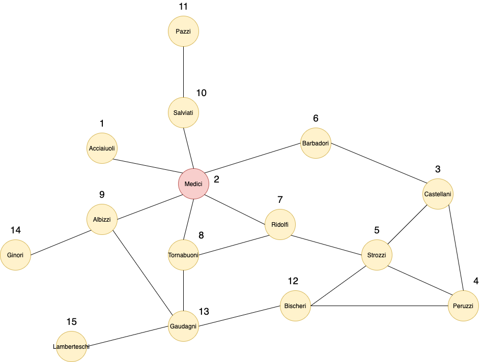

# Graph Representation Learning Implementations

A repository containing my implementations of various algorithms and measures from the book "Graph Representation Learning" by William L. Hamilton.

Implementations will be in Python using Numpy, but I will turn to PyTorch when dealing with Graph Neural Networks.

I will use the Florentine Marriage Network from "Robust Action and the Rise of the Medici" (Padgett and Ansell, 1993) for many of the implementations.

It concerns the study of the Medici family in Florence during the 15th century. You can already see that the Medici family has the most connections (edges), which could be an indicator of their influence (we'll see). 

### License

MIT
